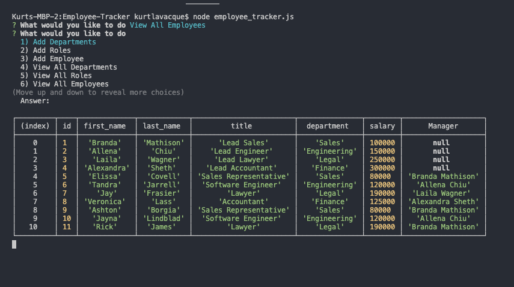
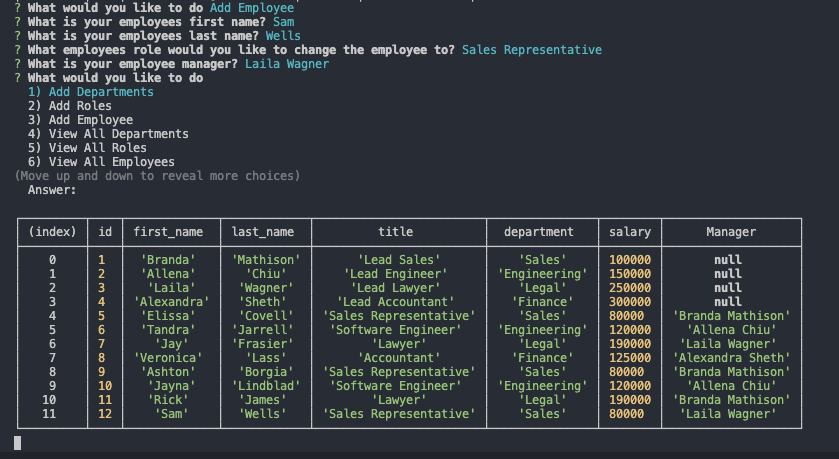
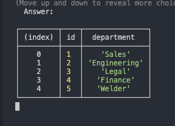
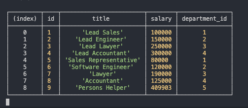

# Employee-Tracker

## About The Project

I created a fully server side company database that contains data about

* Employees
* Employee Roles
* Departments

Giving a company piece of mind knowing that their database can be viewed, and edited from one location, on a straightforward and clean terminal interface

### Features

The ability to search through the database add and edit

* To add and update employee data
* Add new departments
* Add new roles

### Built With

* [Javascript](https://developer.mozilla.org/en-US/docs/Web/JavaScript)
* [Node.js](https://nodejs.org/en/docs/)
* [mySQL](https://www.npmjs.com/package/mysql)
* [Inquirer](https://www.npmjs.com/package/inquirer)

<!-- GETTING STARTED -->
## Getting Started

* First copy and paste schema.sql into MySQL workbench and run it
* Next run the employee_tracker.js in your terminal, making sure to be in the correct directory
* You will be offered a list of options shown below
    * Add Departments,
    * Add Roles,
    * Add Employee,
    * View All Departments,
    * View All Roles,
    * View All Employees,
    * Update Employee Roles,
    * Exit
* In each menu you will be shown a variety of options that will give you access to the employee, role, and department data

### Add Employee

### View Roles

### View Departments

